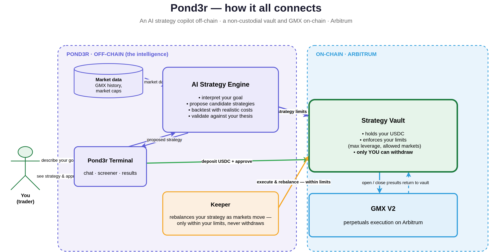

# Pond3r

**An AI trading terminal for GMX perpetuals.** Describe an investment goal in plain language;
Pond3r turns it into a backtested, validated strategy — single-position or portfolio-level across
many markets — and executes it on GMX. Your funds stay in a **non-custodial vault**, and an
automated keeper rebalances the strategy within **on-chain limits it cannot violate**.

- **Off-chain (the intelligence):** an AI strategy engine that interprets intent, proposes candidate
  strategies, backtests them with realistic costs, and validates them against your thesis.
- **On-chain (Arbitrum):** a single-depositor `StrategyVault` that holds your USDC, executes
  owner/keeper-approved GMX v2 orders, and enforces a **mandate** (max leverage, allowed markets,
  reduce-only for the keeper). GMX v2 powers execution.

## Architecture



You describe a goal → the AI engine proposes & backtests (fed by ingested market data) → you deposit
USDC and the engine sets your on-chain limits → the keeper executes and rebalances **within those
limits** → GMX runs the perps → results return to your vault. **Only you can withdraw.**

## Repository layout (pnpm + uv monorepo)

| Path | Package | What it is |
| --- | --- | --- |
| `agent/` | `@pond3r-portfolio/agent` | Backend: Fastify API (`src/api/server.ts`), the opencode-SDK agent layer (`src/agent/`), the deterministic strategy workflow (`src/agent/workflow/`), the keeper/live-allocation mapping, Drizzle/Postgres (`src/db/`), and data ingestion (`src/ingestion/`). |
| `agent/scripts/` | `pond3r-portfolio-scripts` (Python) | The compute layer — crypto signal/backtest logic on the `bt` library, invoked via one dispatcher CLI (`python -m agent_invest_scripts.cli`, wrapper `agent/pond3r-portfolio`). |
| `contracts/` | `@pond3r-portfolio/contracts` | Foundry/Solidity. `StrategyVault.sol` (single-depositor, beacon-upgradeable GMX v2 vault with keeper + mandate), `VaultFactory.sol`. See **`contracts/deployments.md`**. |
| `frontend/` | Next.js app | Chat + wizard, run inspector, eval tools; Privy auth; deploys the vault on-chain. **Non-standard Next.js — read `frontend/AGENTS.md`.** |

## Prerequisites

- **Node.js ≥ 22** and **pnpm ≥ 10** (the repo enforces pnpm; `npm`/`npx` are blocked).
- **[uv](https://docs.astral.sh/uv/)** for Python dependencies (applies a package age gate).
- **[Foundry](https://book.getfoundry.sh/)** (`forge`) for the contracts.
- **Docker** (for Postgres and the optional full stack).
- **Postgres** — exposed on host port **`5434`** (not 5432) to coexist with other local Postgres.

## Installation

```sh
pnpm install              # JS deps for all workspaces
pnpm py:sync              # Python deps via uv (7-day package age gate)
pnpm contracts:build      # compile contracts (forge)
```

## Configuration

Code auto-loads `.env` (TypeScript via `env.ts`, Python via `db.py`) — the runtime already has its
secrets; **never commit, grep, or export `.env` secrets.** Key variables:

- `DATABASE_URL` — Postgres (host port `5434`).
- `RESEARCH_MODE` + `AGENT_READONLY_DATABASE_URL` — opt-in research sandbox; the readonly DB role
  should be `agent_readonly` (SELECT-only, statement timeout, read-only transactions).

Apply database migrations:

```sh
pnpm db:migrate
```

## Running locally

```sh
pnpm dev                  # agent API server (tsx watch)
pnpm --filter frontend dev   # frontend on http://localhost:4000
```

Out-of-band data ingestion (the agent only reads ingested data — it does not fetch):

```sh
pnpm ingest:gmx:history
pnpm ingest:gmx:markets
pnpm ingest:coingecko-market-caps
```

Agent compute CLI (from `agent/`):

```sh
./pond3r-portfolio list           # list subcommands
./pond3r-portfolio help <cmd>
./pond3r-portfolio <cmd> [args]   # CLI flags in, JSON to stdout
```

## Tests

```sh
pnpm test                                   # agent TypeScript tests
pnpm --filter @pond3r-portfolio/agent typecheck
pnpm contracts:test                         # Foundry tests
cd agent/scripts && uv run pytest           # Python tests
```

## Smart contracts

`StrategyVault` is a **single-depositor**, beacon-upgradeable collateral
vault that executes owner/keeper-approved GMX v2 perp orders.

- **Keeper role** — an off-chain key that can execute/rebalance GMX orders but can never withdraw
  funds or change config (all fund-exit/config paths stay owner-only).
- **Mandate** — optional market allowlist + an oracle-free leverage ceiling enforced on increase
  orders; collateral-withdrawing decreases are owner-only so the keeper can never raise leverage.

```sh
pnpm contracts:build
pnpm contracts:test
pnpm contracts:fmt
```

Deploy / upgrade scripts live in `contracts/script/`. Vaults are beacon
proxies, so a single `UpgradeStrategyVault` run upgrades every existing vault; new storage is
append-only, so existing vaults keep their state.

### Deployed addresses (Arbitrum One, chain id `42161`)

| Contract | Address |
| --- | --- |
| `StrategyVault` implementation | `0xF33050467dDC712a35022297d1e31A7B8d7ad07A` |
| `VaultFactory` | `0xd335d60DF2B199Cc3E7438A79a2725F64bD29F3b` |
| `UpgradeableBeacon` | `0x637C3338D7FdE7092Aba28a6F98dc598D143CD78` |
| Collateral (USDC) | `0xaf88d065e77c8cC2239327C5EDb3A432268e5831` |

Full history and GMX routing in `contracts/deployments.md`.

## Docker

```sh
docker compose up --build
```

The compose stack binds `./.data` into the container so local data and caches survive restarts.
Postgres is exposed on host port `5434`.

## Package manager policy

Use **pnpm** for all JavaScript dependency operations (`npm`/`npx` are blocked by a preinstall
guard). Use the root scripts for Python so uv applies the package age gate:

```sh
pnpm py:lock
pnpm py:sync
pnpm py:sync:frozen      # production / CI — aligns with agent/scripts/uv.lock
```
